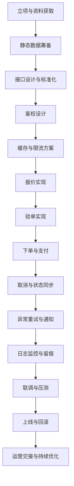
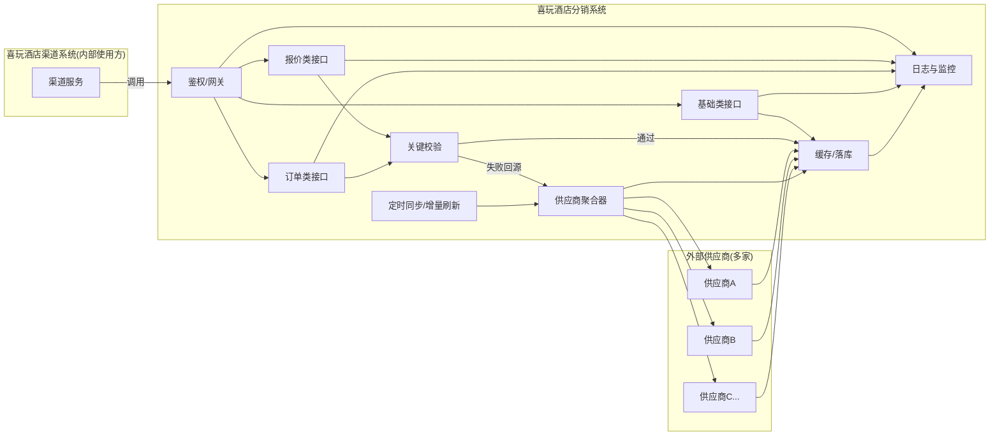

# 供应商集成开发文档

## 1. 供应商接入开发流程
本流程面向对接“酒店供应商”接口的研发与测试同学，目标是以最少沟通成本、最高一致性完成供应商从立项到上线全链路落地。流程紧密依照本仓库已定义的标准：X系列标准信息（见第3章）、接口鉴权（见第5章）、对接步骤与注意事项（见第6、7章）。

### 1.1 流程总览（Phase & 产出物）
- __立项与资料获取__：确认合同主体、接口文档、测试账号/IP 白名单、QPS 限制、币种/国籍策略、是否即时确认等。产出物：对接方案草案、需求清单。
- __静态数据筹备__：根据供应商能力确定国家/城市/酒店/房型等表设计与刷新策略（见第6章-1、国际静态原文存储建议）。产出物：表结构与任务计划。
- __接口设计与标准化__：统一采用 X 系列数据模型，明确跨层信息策略与组装信息（见第3章）。产出物：接口契约（入出参示例）。
- __鉴权设计__：按第5章采用 MD5 简单签名，发放 app/secret，定义失效与容忍窗口。产出物：Key 管理与验签中间件。
- __缓存与限流方案__：结合供应商 QPS 实施价格缓存、全量/增量刷新（见第6章-2/4/5、13），并对外提供健康稳定的读接口。产出物：缓存键与过期策略、刷新任务说明。
- __报价实现__：支持价格日历/非日历两种模式与多账号聚合、分组去重（见第7章-10/11/12/13、15）。产出物：报价模块与聚合规则。
- __验单实现__：详细记录每次验单日志与成功率指标（见第6章-3）。产出物：验单服务与审计表。
- __下单与支付__：亏损拦截、默认补全联系方式、供应商支付链路内聚（见第7章-4/6/30）。产出物：下单服务、风控校验。
- __取消与状态同步__：同步/异步取消策略与状态机、免费取消规则建模（见第7章-14、24、36）。产出物：取消服务、订单状态回写。
- __异常重试与通知__：失败重试、拒单告警、对 xw 通知（见第6章-8）。产出物：重试/告警策略与运维联动。
- __日志监控与留痕__：统一日志、原文落库、链路追踪、关键指标看板（见第7章-22/23/34）。产出物：监控面板与审计报表。
- __联调与压测__：沙箱联调、数据对齐校验、逐步放量压测（QPS/延迟/错误率）。产出物：联调报告与压测结论。
- __上线与回滚__：容器化部署、分区机房（国际放海外，如香港，见第7章-31/32）、蓝绿/灰度、回滚预案。产出物：发布单与回滚剧本。
- __运营交接与持续优化__：有价酒店采集、渠道标识接入、问题复盘（见第7章-26/27/17/21）。产出物：SOP 与周/月报。

### 1.2 关键里程碑与检查清单（Checklist）
- __M1 立项通过__：
  - 已拿到接口文档/账号与 IP 白名单
  - 明确 QPS/超时/币种/国籍/账号类型策略（见第7章-15）
  - 订单是否即时确认、取消规则时区/格式确认（见第7章-14、国际供应商项）
- __M2 数据与模型完备__：
  - 静态表与原文存储方案评审通过（见第6章-1、7章-39/40）
  - X 系列字段映射表完成，跨层信息决策完成（见第3章-3.2）
- __M3 鉴权与网关验收__：
  - MD5 签名联调通过、时间戳偏差校验10分钟（见第5章）
  - 白名单/限流/降级策略可用
- __M4 报价/验单可用__：
  - 价格日历/非日历路径可回归，聚合与去重符合预期（见第7章-10/11/12/13）
  - 验单日志落库且有成功率看板（见第6章-3）
- __M5 订单全链路__：
  - 亏损拦截、默认联系人补全，下单-支付内聚
  - 取消（同步/异步）策略明确并回归（见第7章-24）
- __M6 运维与上线__：
  - 容器化、环境分区、国际线路落地（见第7章-31/32）
  - 告警/看板/审计开启，蓝绿/回滚演练完毕

### 1.3 接口与数据规范要点（落地指引）
- __统一模型__：严格输出 X 系列层级与字段分类：基本/跨层/组装（见第3章-3.2），跨层字段需存在“未设置”状态。
- __URL 规范__：`/api/xiwanSupplier/supp/getPrice` 风格，兼容大小写与前缀个性化（见第7章-3）。
- __取消规则__：国内“小时前可退”统一结构；国际按时间段连续区间，含当地时区原文与北京时间，需补齐免费区间（见第7章-14）。
- __价格口径__：RatePlan 为单间多晚合计，Daily 为单间单晚；多房规格需平均化（见第7章-10）。
- __多账号聚合__：同 RP 取最低价并在 rpid 标注账号标识；不同 RP 聚合维度：取消/餐食/预订规则（见第7章-15）。
- __价格阈值__：国内 Daily 小于20或大于30000 视为满房（见第7章-20）。
- __编号规范__：过长的 RoomId/RatePlanId/供应商单号需 MD5/短号映射（见第7章-7/8）。

### 1.4 运行时能力（稳定性与可观测）
- __缓存策略__：结合 QPS 与价格日历能力，支持全量/增量/热 key 刷新，过期与淘汰策略清晰（见第6章-2/4/5、13）。
- __隔离与降级__：报价与验单/订单接口分站点隔离；限流与熔断降级（见第7章-22）。
- __日志与留痕__：验单/下单/取消请求与供应商原文全量落库，关联渠道、IP、app（见第7章-21/23）。
- __监控与告警__：关键指标包含：QPS、成功率、延迟、错误码、拒单、库存命中率、缓存新鲜度；异常拒单需回调 xw（见第6章-8）。

### 1.5 联调与上线注意事项
- __测试数据选择__：选择一个月后、可免费取消、金额小的样例；控制下单次数（见第7章-25）。
- __渠道侧协作__：要求提供 `channel`/`channelCompany` 标识，便于分渠道质量监控（见第7章-17/21）。
- __接口文档暴露__：正式环境不公开 Swagger，如需开放务必加登录（见第7章-34）。
- __环境与地域__：国际供应商部署至海外节点，降低时延（见第7章-31）。

### 1.6 责任分工建议
- __后端研发__：数据建模/接口实现/缓存任务/稳定性建设。
- __QA__：用例设计（价格日历/多账号/取消规则）、灰度与回归。
- __运维__：发布编排、监控告警、容量与回滚预案。
- __产品/运营__：有价酒店策略、渠道协同、异常拒单处置。

> 温馨提示：
> - 鉴权实现与示例请参考“第5章 接口鉴权”。
> - 端到端步骤与边界策略请复核“第6章 对接供应商开发步骤”“第7章 注意事项”。

### 1.7 业务流程图示


### 1.8 业务数据流图示


## 2. 需求场景
我们作为酒店资源分销商，会对接开发各种供应商资源，然后加价投放到各种渠道售卖；内部有专门对接供应商接口的开发同事，也有对接渠道接口开发的同事。 对接供应商的开发需根据供应商接口实现下方描述的3类接口，后续给渠道端开发调用。

### 接口分类
1. 静态数据
2. 报价
3. 订单

文档下方有具体到每个接口的详细说明。

## 3. X系列标准信息
X系列标准信息，是为了尽可能兼容多个供应商、渠道而调整融合产生的标准信息，后续接入渠道或者供应商都基于此标准信息进行信息转换提高效率；对接供应商接口转换为X系列信息，然后对接渠道的开发会从你接口读取X系列信息。

### 3.1 X系列信息层级
X系列信息主要分为4层，粒度从大到小：

| 分层 | Model |
| :--- | :--- |
| 1 | 酒店 |
| 2 | 物理房型 |
| 3 | 价格计划 |
| 4 | 每日房态房价 |

### 3.2. X系列字段信息分类
每层信息可以分为3类：【基本信息】、【跨层信息】、【组装信息】

| 分类 | 描述 |
| :--- | :--- |
| 1 | 基本信息 |
| 2 | 跨层信息 |
| 3 | 组装信息 |

#### 3.2.1 基本信息
本层固定会有的属性，可以映射到数据表字段的属性，比如酒店层，酒店编号，地址等等

#### 3.2.2 跨层信息
每个供应商产品所描述的预订业务复杂度不一样，就会导致有些属性出现到粒度小的层面或者粒度大的层面；
比如早餐份数，有些供应商的早餐份数描述在价格计划层面，价格计划下面每日房态房价层的早餐份数都保持和价格计划层的一致；
但是又有些供应商业务复杂，比如携程，业务控制粒度为了做到灵活控制，把早餐份数描述在每日房态房价层；
类似这种根据业务控制粒度不同，描述在不同层面的属性叫跨层信息；
属于跨层信息的实体属性，值的变化有可能导致价格的变化，会是客人决定是否要预订的关注信息，所以检查获知某个层面的跨层属性时；
应该先检测子层面此跨层属性是否已设置值，有设置值就应该以子层面的属性为准，或者在对接数据时告诉对接方某某跨层属性以那一层为准;
跨层属性应该尽量具有一个【未设置】的中间状态，比如 int 类型这些值类型应该设置为可空类型作为【未设置】状态，枚举类型应该有一个 Unknown 项作为【未设置】状态

#### 3.2.3 组装信息
为了组装去展示使用而出现的信息，或者计算类属性信息

比如在把价格信息输出到产品端的场景下，需要在酒店层显示该酒店最低价；
或者在价格计划层根据客人所查询入住离店时间范围产生一个价格总计属性方便查看，这些场景都是为了展示信息而计算产生的属性，又比如
在价格计划层面要挂靠每日房态房价信息，这个就是为了输出完整的展示信息而组装产生的属性

#### 3.2.4 分类信息说明
 每加一个属性都要考虑此属性属于哪类，如果是【跨层信息】属性还要考虑此属性的业务粒度问题，然后在涉及的层面都要添加此属性

> **国内需要注意的信息**：有窗/无窗、公共卫浴、早餐、房型/RatePlan 名称敏感词过滤、宾客、床型、连住、最小/最大预订间数、钟点房、取消规则、预付、即时确认、酒店是否提供发票  
> **国际需要注意的信息**：禁烟、景观、入住人数  

• 关键信息必须准确，给错信息会直接导致赔付。
• 订单状态需明确、可追踪。
• 新增字段前请先与 colin 确认。
• 国内供应商床型枚举能转的尽量赋值；若供应商未提供床型且可从房型名明确提取，再进行转换。建议先汇总并落库床型信息，再考虑名称到枚举的转换。

#### 3.2.5 X系列信息使用注意事项
| 描述 |
| :--- |
| 1. 标准格式有些信息供应商是没有的，可以忽略赋值输出，只赋值供应商有的信息 |
| 2. 标准格式不够字段给你去赋值的（用了冗余字段也不够），有些供应商验单下单有些复杂的参数（比如礼包套餐编码），解决方案：应该尽可能把这些复杂的参数融合到价格计划编号里面，用某个字符分隔,调用方验单下单的时候传回给你，你再去拆分解析 |
| 3. 有些供应商下单前需要从验单接口获取一个类似token的参数，解决方案：应该自己内部下单前先验单拿到token参数再下单，不需要渠道开发的同事传达给你 |
| 4. 有些供应商下单后需要调用供应商支付订单接口，解决方案：应该自己内部下单后马上调用支付接口，不需要渠道开发的同事再调你的支付接口；原则就是尽量让渠道开发的同事简单高效的按照报价、验单、下单、查单、取消订单流程去调用你的接口，不需要再问你要供应商原始接口文档去了解供应商的业务 |

如果遇到实在解决不了需要给标准格式加字段通知我这边再加一下

## 4. X系列信息集成到自己的开发项目
### 4.1 Java 开发
Java 标准数据公共包来源于 Lyon，下方是说明，也可以找 Lyon 了解

1.  在`pom.xml`文件当中添加仓库地址:
    ```xml
    <repositories>
        <!-- 定义远程仓库 -->
        <repository>
            <id>nexus-public</id>
            <url>http://192.168.0.204:8082/repository/maven-public/</url>
            <releases>
                <enabled>true</enabled>
            </releases>
            <snapshots>
                <enabled>true</enabled>
            </snapshots>
        </repository>
    </repositories>
    ```
    或者在 `settings.xml` 中添加:
    ```xml
    <!--本地私服仓库地址-->
    <mirror>
        <id>nexus-public</id>
        <name>nexus-public</name>
        <url>http://192.168.0.204:8082/repository/maven-public/</url>
        <mirrorOf>*</mirrorOf>
    </mirror>
    ```
2.  添加依赖:
    ```xml
    <!-- 添加依赖 -->
    <dependencies>
        <dependency>
            <groupId>com.heytrip</groupId>
            <artifactId>supplier-data-standard</artifactId>
            <version>1.1.3-RELEASES</version>
        </dependency>
    </dependencies>
    ```
3.  实现 `ISupplierApiService` 类:
    1.  接口所有方法
    2.  响应实体字段中贴有 `@NotNullFields` 注解，需要特别注意和赋值（序列化 boolean 默认值为 false，int 默认值为 0）
4.  `controller` 层有示例，可以复制：（需要在 IDEA 中下载源码，才能看到注释掉的代码），只需要实现 `ISupplierApiService` 接口业务方法即可！
    1.  `OrderCtrlExample`
    2.  `PriceCtrlExample`
    3.  `StaticCtrlExample`
5.  `LocalDateTime` 入参序列化问题（如 2003-06-06、2023-07-08 00:00:12、2023-07-08T00:00:12）
    1.  复制 `LocalDateTimeBinder` 类到自己项目中，放开注释即可
6.  接口路径需要配置忽略大小写:
    ```java
    @Configuration
    public class WebConfig implements WebMvcConfigurer {
        @Override
        public void configurePathMatch(PathMatchConfigurer configurer) {
            AntPathMatcher matcher = new AntPathMatcher();
            matcher.setCaseSensitive(false);
            configurer.setPathMatcher(matcher);
        }
    }
    ```

## 5. 接口鉴权
因为目前暂时都是内网 HTTP 相互调用，鉴权方式为简单的 MD5 签名，由服务端给调用者颁发 app 和 secret，然后调用者每次请求都在 HTTP Headers 中携带三个参数：`sign`（每次调用的签名）、`app`（你提供给调用者的应用编号）、`timestamp`（秒级时间戳）

`sign=MD5("app"+你提供给调用者的应用编号+"secret"+你提供给调用者的应用秘钥+"timestamp"+秒级时间戳)`

比如： `app123secret456timestamp1234567890` MD5 后的值应该是： `d1f495b9a6c39ff5467226e554887cc7`

服务端收到请求，从 HTTP Headers 提取参数，判断 app 合法性，然后自己生成 sign 与请求的 sign 参数是否一致（不区分大小写），同时根据 timestamp 判断时效，可允许 10 分钟偏差

分配给不同渠道开发对接的接口账号秘钥，要针对不同开发给不同的账号秘钥，比如`app=xw_colin@2409281042`，后面有业务需要还可以针对不同账号做一些数据监控。

调用方每次请求你的接口会在 HTTP Headers 设置以下参数供你校验：以下示例采用的 `secret=J-weFioh#A$^@!_8894tkkhe`

| 参数名 | 参数值示例 | 描述 |
| :--- | :--- | :--- |
| app | `xxx_123@-456@*_` | app |
| sign | `2262bc4b6092bc0b25305f70a39617f6` | sign |
| timestamp | `1743299970` | 秒级时间戳 |

## 6. 对接供应商开发步骤
1.  需要落库持久化静态数据，也要定时刷新，刷新频率可以是1天或2天一次
    *   国内供应商的静态数据一般是城市表，酒店表，房型表
    *   国际供应商的静态数据一般是国家表，语言表，区域表，城市表，酒店表等等
    *   国际供应商信息比较多，遇到信息原文字段比较多的，酒店房型静态信息应该直接存储供应商的原文 JSON，压缩（比如 gzip）后存储数据库，需要统计什么信息再另外写程序去解析分析，酒店表和房型表只维护关键字段信息就好
2.  报价接口，有些供应商会限制我们的QPS，如果我们内部调用的QPS超出供应商的限制，一般需要考虑缓存报价
3.  验单接口（可订检查接口，下单前验证），验单接口每次请求的日志都要记录好，因为渠道会考核我们的验单成功率，所以要记录好，验单成功率低的时候要查日志分析是供应商原因还是我们没有对接好
4.  对接增量接口，国际供应商一般没有增量接口，国际的一般都是实时查询较多，国内的会有增量接口，如果是自己缓存价格的要对接增量接口，保持缓存价格新鲜度，这样渠道端开发的同事读取你的报价新鲜，到时候验单成功率也高
5.  如果有缓存供应商报价的，需要定时全量刷新价格缓存，比如30分钟刷完一次全量价格，保持价格新鲜度
6.  订单相关接口，创建订单/取消订单/查询订单都要记录好日志
7.  先把供应商端的每个接口和流程都模拟测试跑通，然后就是渠道的同事对接，到渠道对接这步，你那边应该算可以上线的程度了
8.  如果供应商订单有确认后还会拒单的情况，需要通知xw系统，引起客服注意，人工跟进（接口具体地址和账号找colin）：
    1.  **根据供应商单号调用(建议不用这种，建议用8.2那种)**
        *   URL: `http://xxx/api/xiwan/xwDistributionOrderOpRecord/setOrderStateBySupplierOrderId?supplierOrderId=123&priceOrderWay=123&state=7&reason=确认后拒单&ext=`
        *   GET 方式
        *   `supplierOrderId`:供应商单号
        *   `priceOrderWay`:每个供应商专属的，问colin
        *   `state`：订单状态，设置7 暂时只支持设置7
        *   `reason`：原因
        *   `ext`:预留扩展参数
        *   返回 Code 为 0 代表设置成功：`{"Data":null,"Page": null,"HasData": true,"Code": 0,"BizCode": 0,"Message": null,"CostTime": null,"IsOk": true}`
    2.  **根据分销商(也就是xw)单号调用(建议用这种)**
        *   URL: `http://xxx/api/xiwan/xwDistributionOrderOpRecord/setOrderStateByDistributorOrderId?distributorOrderId=123&state=7&reason=确认后拒单&ext=`
        *   GET 方式
        *   `distributorOrderId`:分销商(也就是xw)单号,下单的时候有传给你的
        *   `state`：订单状态，设置7 暂时只支持设置7
        *   `reason`：原因
        *   `ext`:预留扩展参数
        *   返回Code为0代表设置成功: `{"Data":null,"Page": null,"HasData": true,"Code": 0,"BizCode": 0,"Message": null,"CostTime": null,"IsOk": true}`

## 7. 📚对接供应商开发注意事项
1.  做供应商的接口对接，输入输出格式都采用我定义的X系列数据格式，这样可以提高内部对接效率，负责渠道对接的开发同事也是按这样的格式对接你的接口进行开发放到渠道去售卖；文档下方有每个接口详细的输入输出描述，创建订单有几个输入字段是必填的要留意（因为是以前的定义没有体现“required”）；返回字段（非对象类型）没有nullable的就代表一定要赋值返回的；
2.  有些供应商有佣金这个说法的，要理解清楚供应商接口返回的报价是什么价格，价格这块，我们要理解两个概念
    *   **2.1. 结算价**（目的是财务后面拿账单与供应商对账），我们的xw订单表会保存每个订单的结算价，方便财务后面导出账单，然后财务拿这个账单与供应商后台系统导出的账单对比，每个订单结算价格是否一致
    *   **2.2. 底价**（就是成本价），一个订单真实的成本价（有些供应商是有佣金的），你们创建订单根据这个价格和渠道的卖价判断是不是亏的
3.  暴露的 HTTP 接口路径保持统一
    *   URL 基本都是小驼峰：`http://xxx:xxx/api/xiwanSupplier/supp/getPrice`
    *   少量为以前形式：`http://xxx:xxx/api/XiwanSupplier/supp/GetPrice`
    *   如果你的接口 URL 区分大小写，请兼容
    *   如果你的接口 URL 需要个性化路径，可以在 `http://xxx:xxx/` 与 `/xiwanSupplier/` 之间添加，例如：`http://xxx:xxx/colin/api/xiwanSupplier/supp/getPrice`
4.  创建订单接口，根据传进来的 `SalePrice`（就是给渠道的卖价），内部对比供应商最新的价格，如果是亏损的拦截不给下单，返回Code非0 参考枚举`XiwanSupplierBusinessCode`
5.  取消订单接口，发起取消前先查询供应商订单状态：
    *   5.1 如果供应商订单状态为“已确认”，而且订单是不可取消或者不是免费取消的都拦截，返回Code非0 参考枚举`XiwanSupplierBusinessCode`
    *   5.2 如果供应商订单状态为“处理中”，就是“未确认”的状态，允许向供应商发起取消，偶尔有些订单是客人下单之后几秒内又申请取消了，这时供应商还没确认订单的
    *   5.3 如果供应商是即时确认的可以不考虑“处理中”的状态，都是拦截扣费取消以及不可取消的就好，一般国际供应商都是即时确认的，国内供应商大多不是即时确认的
6.  有些供应商下单要求必填手机、电话号码、邮箱的，如果调用方没有传应该都设置默认的，大多数情况调用方是不会传的，默认号码找客服gary要一下，跟gary要的时候说明你这个供应商是和哪个公司主体签约的，这个号码、邮箱是根据你当前负责的供应商和我们哪个公司主体签约不同而不同的
7.  如果接口输出的供应商 `RoomId`、`RatePlanId` 超过 64 字符，需 MD5 之后再输出给调用方；调用方验单传入的编号也应为 MD5 之后的。内部需先获取最新报价，将 `RoomId`、`RatePlanId` 均做 MD5 后进行匹配
8.  如果供应商单号过长，也需要内部维护一个供应商单号对比表，构造一个短的单号输出，因为xw订单表的供应商单号字段只有50字符长度
9.  国际供应商涉及到汇率的，我们都是返回供应商的原币种价格，如果供应商支持多币种查询的才需要使用currency参数，如果供应商不支持多币种查询的，统一让调用方去自己根据汇率转，我们内部有一套汇率维护的。后续做缓存也是看供应商原币种的，所以不需要对接供应商这端去做汇率转换
10. RatePlan 层返回的价格是 1 间多晚的合计（即 Daily 的合计），Daily 是单间单晚的价格，注意！！
    *   10.1. 有些供应商支持多房间不同入住人数规格查询，比如 `occupancy=1_2`，然后报价返回两间房不同的价格，RatePlan 的价格应为两间房总价/2，保留两位小数（2.123 保留为 2.13）
11. 一般我们内部读取到供应商的价格，给调用方输出报价前RatePlan层都要根据“预订规则”“取消规则”“餐食类型”分组，取最低报价的价格计划输出；因为有些供应商会输出多个重复的，如果你明确供应商不会有重复的可以不用分组处理
12. 国内供应商，基本都要理解“价格日历”的概念，明确供应商的报价接口返回的价格是“价格日历模式”还是“非价格日历模式”
    *   12.1 “非价格日历”，比如请求2023-01-01至2023-02-07总共入住6晚，其中“大床房”每晚都有价有房可住，“双床房”只有2023-01-02有房其他日期没有房，如果供应商是“非价格日历”，那他的报价接口应该只返回“大床房”的价格，因为明确请求需求是要连住的
    *   12.2 “价格日历”，根据开始日期和结束日期请求一段时间的所有房价，还是上面那个例子请求2023-01-01至2023-02-07，如果供应商是“价格日历”，那应该“大床房” “双床房”都返回
    *   12.3 理解“价格日历”的概念有助于你做缓存价格，大多数国内供应商都有 QPS 限制的，比如需要缓存供应商 30 天内的价格，如果供应商价格接口是“价格日历”模式就可以一次请求 30 天的报价落地缓存，如果供应商是“非价格日历”那一个酒店就要请求 30 次
13. 国内供应商，一般都做价格日历缓存的： （国内的都只有早餐，几乎没有晚餐午餐的）
    *   13.1 调用方设置参数`mode=1`的时候，价格日历，返回的数据：
        *   13.1.1 取消规则，取消规则都体现在 Daily 层，RatePlan 层的取消规则取每日里最差那种赋值
        *   13.1.2 早餐，MealType 都设置为 1，早餐数量都体现在 Daily 层，RatePlan 层的早餐数量取每日最少那种赋值
        *   13.1.3 预订规则，预订规则都体现在 Daily 层，RatePlan 层的预订规则取每日里最差那种赋值
    *   13.2 调用方设置参数`mode=2`的时候，非价格日历，返回的数据：
        *   13.2.1 取消规则，取消规则都体现在 RatePlan 层，Daily 层的取消规则字段为 null，如果你对接的供应商取消规则是具体到每日的，就取最差的那个挂到 RatePlan 层
        *   13.2.2 早餐，MealType 都设置为 1，早餐数量都体现在 RatePlan 层，Daily 层的早餐数量字段为 null，如果你对接的供应商取消规则是具体到每日的，就取最差的那个挂到 RatePlan 层
        *   13.2.3 预订规则，预订规则都体现在 RatePlan 层，Daily 层的预订规则字段为 null，如果你对接的供应商取消规则是具体到每日的，就取最差的那个挂到 RatePlan 层
    *   13.2.4 验单接口返回的数据，上面说的预订规则、取消规则、早餐要 Daily 和 RatePlan 层都赋值，就是融合 mode 等于 1、2 的情况。
14. 返回的免费取消规则数据定义
    *   14.1 国内的供应商，一般都做价格日历缓存的，都做成下面这种免费取消规则返回： `{"Desc": "从入住日24点往前推多少小时可退","Hours":6,"DeductType": 4}`
    *   14.2 国际的供应商，大多数都是按时间段范围可取消的规则，国际一般都没有价格日历的，都做成按时间段的格式返回：
        每个取消规则时间段要连续
        `StartTime`，`EndTime`北京时间
        `StartTimeOrig`，`EndTimeOrig`（供应商原文的时间，一般是酒店当地时间）
        如果存在可免费取消的，供应商只返回收费取消的时间段，取消规则第一行要构造可免费取消的时间段，构造的免费取消时间段，第一个行时间`StartTime`要小于当前北京时间，可以取今天凌晨赋值
        `"StartTime": "2024/05/07 00:00:00"` 以前少量是这种格式返回，正常都是标准的ISO8601格式`2024-05-07T00:00:00.000+08:00`,.net是全兼容的，如果有不兼容的要留意
    *   14.3 请设置好是否可取消字段，`Cancelable`，调用者正常都是先判断你返回的`Cancelable=true`,再看你的`CancelRules`具体规则
        ```json
        "CancelRules": [
            {
                "Desc": "2024-09-30 19:00:00前可免费取消",
                "LastCancelTime": null,
                "Hours": null,
                "IsAfter": null,
                "DeductType": 4,
                "DeductValue": null,
                "StartTime": "2024/05/07 00:00:00",
                "EndTime": "2024/09/30 19:00:00",
                "StartTimeOrig": "2024-09-30T18:00:00.000+07:00",
                "EndTimeOrig": "2024-09-30T18:00:00.000+07:00",
                "DescOrig": "2024-09-30T18:00:00.000+07:00前可免费取消"
            },
            {
                "Desc": "2024-09-30 19:00:00至2024-10-01 19:00:00扣100%",
                "LastCancelTime": null,
                "Hours": null,
                "IsAfter": null,
                "DeductType": 3,
                "DeductValue": 1,
                "StartTime": "2024/09/30 19:00:00",
                "EndTime": "2024/10/01 19:00:00",
                "StartTimeOrig": "2024-09-30T18:00:00.000+07:00",
                "EndTimeOrig": "2024-10-01T18:00:00.000+07:00",
                "DescOrig": "2024-09-30T18:00:00.000+07:00至2024-10-01T18:00:00.000+07:00扣100%"
            }
        ]
        ```
15. 目前query参数值，有些供应商已经启用如下类似的参数，大家可以尽量用一致的 `query={"AccountType":"b2b","Nationality":"CN"}`
    *   `AccountType:"b2b"` 供应商接口账号类型，有多账号也可以英文逗号分隔，内部做好聚合b2b,b2c，多账号默认是否启用聚合，根据实际情况定义
    *   `Nationality："CN"` 客人国籍
    *   `Platform："mobile"` 有些供应商有区分手机价 pc价
    *   `AddRoomStaticInfo：false` 是否需要在返回报价中查询基础房型信息组合输出
    *   `Timeout：10000` 访问供应商超时时间（毫秒）
    *   `ThirdPartyInventory：false` 是否输出第三方资源报价
    *   `Companys：["Xiwan"]` 多公司主体签约账号
    *   `PayType:1` 1现付 2预付 -1输出所有 默认预付 （从基础枚举来的）
    *   `PriceType:"genius"` 供应商个性化价格类型标识
    *   多账号的内部聚合价格，同样RP编号只露出价格最低，然后价格计划编号加所属账号标识，类似_b,_c，后续流程自己内部解析。
    *   如果存在多账号RP编号都不一样的就根据3个关键因素聚合“取消规则（免费取消时间点）”，“餐食信息”，“预订规则”。国际供应商还可以考虑加入“到店付费用”
16. 对接完供应商接口，回答下方问题发给colin 有些问题可以问下市场协助填写
    *   供应商是哪个国家的公司（国际供应商回答）？
    *   供应商是与我们哪个公司主体签约？
    *   价格是否有佣金相关的说法？
    *   酒店总量有多少？
    *   有价酒店有多少？
    *   供应商的报价接口是否有价格类型参数，比如手机价，pc价？
    *   供应商主要价格优势比较好的地区有哪些（国际供应商回答）？
    *   供应商的实时报价接口响应速度如何，平均500毫秒？
    *   供应商的报价接口目前给到我们最大QPS是多少？还是说没有限制按照查订比那种？
    *   如果供应商的报价接口响应慢，对方的服务器IP是哪个地区的（国际供应商回答）？
    *   供应商的订单下单成功是否就代表确认有房（是否即时确认）（国际供应商回答）？
    *   取消规则是否有时间相关的描述，时间是否有时区（国际供应商回答）？
    *   RatePlan层的价格是否多晚总价，是否乘以房间数之后就是订单总价？
    *   我们和供应商的结算币种是？
    *   是否支持设置不同币种参数查询报价？
    *   是否支持设置国籍参数查询报价？
    *   是否支持多个酒店批量查询报价？最多多少个酒店？
    *   查询报价支持查询连住最大多少晚？
    *   供应商是否存在几套价格，b2b，b2c 价格？
    *   如果供应商下单要求必填手机、电话号码、邮箱等等，是否已经找gary要默认的？
    *   如果供应商下单要求每个入住人都要有姓名，下单接口入参，2人入住1间房，如果调用方只传一个人的姓名，是否会内部复制产生第二个人的姓名给供应商？
    *   所有接口URL `/api/xiwanSupplier/supp/getPrice` 前面部分是否已兼容不区分大小写，至少兼容这三种`/api/xiwanSupplier/supp/getPrice`  `/api/XiwanSupplier/Supp/GetPrice`    `/api/XiwanSupplier/supp/GetPrice`?
17. 平常渠道端访问内部供应商报价接口，验单接口，尽量要求他们给`channel` `channelCompany` 配置属于渠道的标识，字符串类型的，知道自己渠道枚举值就直接赋值，不知道的就随便定义属于自己的也行，方便你们监控数据情况 ，有渠道验单成功率差的要跟进，验单失败的都应该找到具体原因
18. 大家自己做的供应商接口，分配给不同渠道开发对接的接口账号秘钥，要针对不同开发给不同的账号秘钥，比如`app=xw_colin@2409281042`，后面有业务需要还可以针对不同账号做一些数据监控的
19. 床型枚举（国内供应商），双床就是代表两张床，双人床是大床，业务不熟不确认的都要先了解清楚再做，我给的在线文档都要仔细看，预订规则、取消规则、餐食类型、床型、有窗无窗、有窗无窗、公共卫浴、宾客类型这些关键信息都要注意的，给出去的信息搞错了，来的订单都要赔钱的
20. 国内供应商单晚单间价格（daily）里面的，价格小于20，大于3万的屏蔽输出，当满房处理
21. 平常渠道端访问内部供应商报价接口，验单接口，尽量要求他们给`channel` `channelCompany` 配置属于渠道的标识，字符串类型的，知道自己渠道枚举值就直接赋值，不知道的就随便定义属于自己的也行，方便你们监控数据情况 ，有渠道验单成功率差的要跟进，验单失败的都应该找到具体原因，验单记录把调用方的访问IP和访问的接口账号app都落库记录好
22. 报价接口的QPS是比验单，订单相关的接口高很多的，所以验单订单相关接口都独立一个站点出来，不要因为报价接口出问题影响全局，特别是请求量大的
23. 验单（包括验单环节中获取实时报价）、下单、取消订单，访问供应商接口的参数和响应的原文都要落库记录好，方便出现赔付的订单，要核实是否供应商的责任然后给原文给客服去追责
24. 取消订单接口，如果供应商的取消接口是同步取消的（马上确认是取消成功的），要赋值好`Code=0`代表取消成功，不是取消成功的不能设置为0（同步取消的），同时最好也设置Data中订单状态`Status=9`（已取消）（预防有人结合两个判断），`Code=非0`代表取消失败；如果供应商的取消接口是异步取消的（是否取消成功要等后续查询订单状态获知），可以设置`Code=0`代表操作成功，并且返回Data中订单状态`Status=8`(申请取消中)。大部分供应商都是同步取消的，异步取消的最好明确告知调用方，异步取消的供应商上线前跟colin说下。正常来说只要做好是在免费时间段内可取消的才调用供应商接口，应该都是可以做同步取消的，如果最后取消失败了其实都是供应商的责任，只有已入住的那种才会失败（这种情况极少的，按理供应商内部也会同步到这个信息）。
25. 在供应商正式接口测试流程，一定要选择一个月后入住，可免费取消的，金额尽量小的测试，不能测多，测两单没问题就行；
26. 加一个服务一直在维护有价酒店列表，2天内要跑完一次全量酒店，采用3个入离日期（一周后某个工作日入住一天，两周后的某个工作日连住2天的入离，三周后入住一天），只要有一个入离有价就算有价，后面两个入离就不用跑了，记录好采集到有价的今天的日期，别人通过可售酒店编号接口来拉取你的有价酒店的时候，你就根据最近7天采集到有价的（最近7天是指采集时间，不是入离日期）都算有价酒店去返回。根据自己的供应商QPS实际限制情况去做调整，大概是这样的思路跑出大概的有价酒店；如果供应商接口有明确的有价酒店接口，也可以直接采用供应商的标识。一周中周5周6入住算周末，因为工作日入住没那么容易满房，如果QPS充足也可以加一个周末入住的有价采集。
27. 平常跑有价酒店名单那个程序，除了标识有价，也要有意识的把一些特殊标识也落库，比如“促销”标签的，有宾客限制的， 含第三方库存价格的，这些类似的也落库好标识到酒店层面，后面有业务需要统计马上就可以查出来。
28. 国内供应商，床型名或房型名 包含“混住”、“床位”、"单人"、“上下铺”字眼的，强制设置最大入住人数1人。
29. 请求供应商接口，Http都要在header加压缩配置，减少服务器带宽使用
30. 关于价格字段，底价`BasePrice`是必填的，`Price`(指导价) `MemberPrice`(会员价) 这两个针对卖价模式，开票价格等业务场景给调用者使用的，所以`BasePrice`必填，如果供应商没有指导价开票价格这些业务就把`Price`，`MemberPrice`设置成`BasePrice`一样就行
31. 国际供应商都要部署到国外地区服务器，比如香港
32. 部署正式环境都要容器化部署
33. 订单详情要支持只提供渠道订单号查询订单详情，因为偶尔会出现下单超时或者接口报错,导致渠道拿不到供应商订单号；根据自己的下单记录捞回来
34. 正常环境一般不需要暴露接口文档，比如swagger文档，如果暴露也一定要加上登录验证才允许访问。
35. 创建订单接口，下单失败的情况，如果是没有调用供应商下单接口，即“明确”是没有下单供应商成功的，设置`BizCode=(int)XiwanSupplierBusinessCode.创建订单失败明确未提交成功`(下单接口处有描述对应的错误代码)，方便调用者获知此单明确未下单成功。
36. 国际供应商，收费取消跟不可取消都直接标识不可取消，目前我们不支持收费取消。
37. 如果存在使用“早餐+取消规则”生成rpid的情况，比如使用md5加密生成rpid，生成规则要精简，因为供应商输出的取消规则，不可取消这块的日期，他们经常是随时间跟日期变化，这样会导致我们rpid会变化，所以这里“取消规则” 字符的定义要注意，不可取消就标识“0”字符，可免费取消就取免费取消日期，比如5月1日之前可以免费取消，就记录250501，这里说的只是md5的内容，实际商家原始的取消规则我们是要保存的；
38. 如果下单接口供应商明确返回拒单或者我们都没有调用供应商下单接口就已经失败(例如校验亏损或无房),请返回`BizCode= 804213`,售卖渠道会通知客人已拒单,是百分百确认没有下单才这样返回；
39. 酒店房型静态信息应该直接存储供应商的原文json，压缩（比如gzip）后存储数据库，需要统计什么信息再另外写程序去解析分析，酒店表和房型表只维护关键字段信息就好
40. 一般对接供应商需要有这些数据表维护好：静态信息原文表，国家表，城市表，酒店表，房型表，验单记录表，创建订单记录表，取消订单记录表
