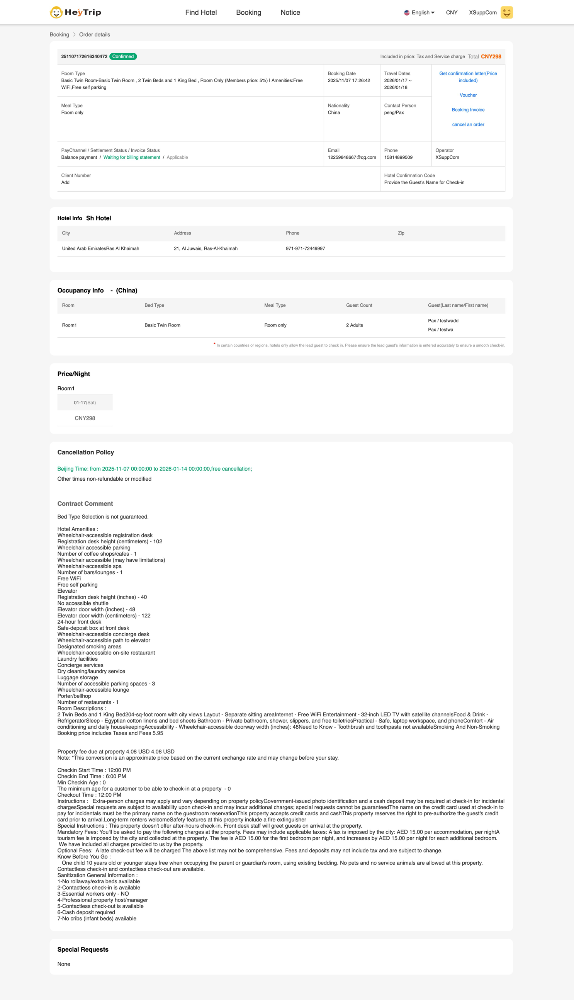
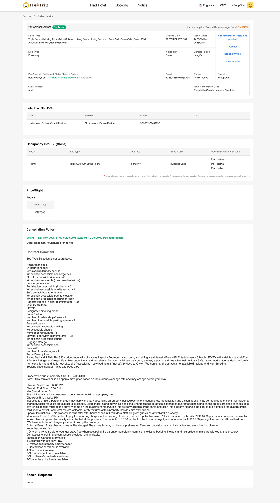
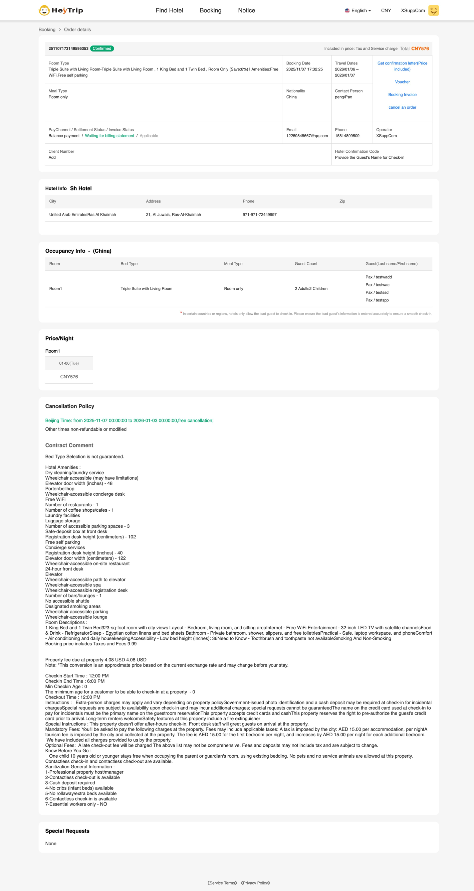
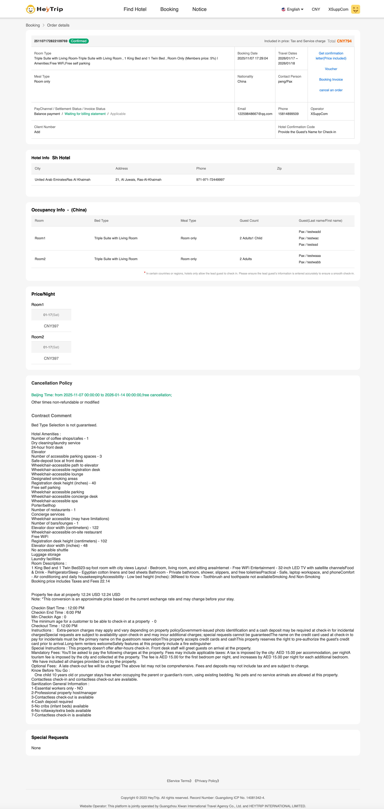
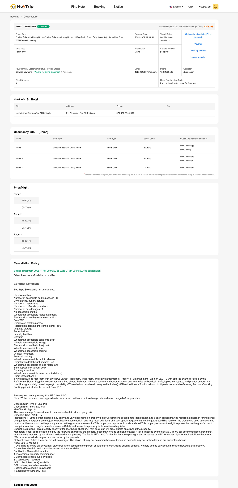

##  Acceptance Certification 


###  2 Adults × 1 Room (Total Rooms: 1)
- Hotel Country:  138  迪拜  Dubai
- Hotel Name: Sh Hotel
- Hotel Id: OT000732790
- Order Number: 251107172616340472
- Booking Id: 21537
- Total Charges:  HeyTrip = 298 CNY   AOS = 297.08 CNY
#### Hotel Booking Details  image


#### Reserved successful response body：
```json
{
  "bookingServiceType": "hotels",
  "bookingDetail": {
    "id": "21537",
    "agentId": "824",
    "bookingReference": "COH21537",
    "bookingDate": "2025-11-07 09:26:55",
    "totalCharges": 297.08,
    "leaderTitle": "MR",
    "leaderFirstName": "testwadd",
    "leaderLastName": "Pax",
    "currencyCode": "CNY",
    "localHotelId": "OT000732790",
    "hotelName": "SH HOTEL",
    "countryName": "United Arab Emirates",
    "cityId": "Ras al khaimah",
    "hotelAddress1": "Istanbul Super Market Saqr Hospital",
    "currentStatus": "vouchered",
    "totalAdults": "2",
    "totalChildren": "0",
    "totalRooms": "1",
    "checkInDate": "2026-01-17",
    "checkOutDate": "2026-01-18",
    "agentRefNo": "251107172616340472",
    "roomDetail": [
      {
        "roomTypeDescription": "Basic Twin Room , 2 Twin Beds and 1 King Bed , Room Only (Members price: 5%) | Amenities:Free WiFi,Free self parking",
        "numberOfRoom": "1",
        "passengers": [
          {
            "salutation": "MR",
            "firstName": "testwadd",
            "lastName": "Pax",
            "passengerType": "adult",
            "age": ""
          },
          {
            "salutation": "MR",
            "firstName": "testwa",
            "lastName": "Pax",
            "passengerType": "adult",
            "age": ""
          }
        ]
      }
    ]
  },
  "message": "Success",
  "startTime": "2025-11-07 09:26:55",
  "endTime": "2025-11-07 09:27:22"
}
```


### 2 Adults + 1 Children × 1 Room (Total Rooms: 1)
- Hotel Country:  138  迪拜  Dubai
- Hotel Name: Sh Hotel
- Hotel Id: OT000732790
- Order Number: 251107170020215459
- Booking Id: 21534
- Total Charges:  HeyTrip = 565 CNY   AOS = 564.23 CNY
#### Hotel Booking Details  image   


#### Reserved successful response body：
```json
{
  "bookingServiceType": "hotels",
  "bookingDetail": {
    "id": "21534",
    "agentId": "824",
    "bookingReference": "COH21534",
    "bookingDate": "2025-11-07 09:02:59",
    "totalCharges": 564.23,
    "leaderTitle": "MR",
    "leaderFirstName": "testwadd",
    "leaderLastName": "Pax",
    "currencyCode": "CNY",
    "localHotelId": "OT000732790",
    "hotelName": "SH HOTEL",
    "countryName": "United Arab Emirates",
    "cityId": "Ras al khaimah",
    "hotelAddress1": "Istanbul Super Market Saqr Hospital",
    "currentStatus": "vouchered",
    "totalAdults": "2",
    "totalChildren": "1",
    "totalRooms": "1",
    "checkInDate": "2026-01-13",
    "checkOutDate": "2026-01-14",
    "agentRefNo": "251107170020215459",
    "roomDetail": [
      {
        "roomTypeDescription": "Triple Suite with Living Room , 1 King Bed and 1 Twin Bed , Room Only (Save:10%) | Amenities:Free WiFi,Free self parking",
        "numberOfRoom": "1",
        "passengers": [
          {
            "salutation": "MR",
            "firstName": "testwadd",
            "lastName": "Pax",
            "passengerType": "adult",
            "age": ""
          },
          {
            "salutation": "MR",
            "firstName": "testwa",
            "lastName": "Pax",
            "passengerType": "adult",
            "age": ""
          },
          {
            "salutation": "Child",
            "firstName": "testssd",
            "lastName": "Pax",
            "passengerType": "child",
            "age": "8"
          }
        ]
      }
    ]
  },
  "message": "Success",
  "startTime": "2025-11-07 09:02:59",
  "endTime": "2025-11-07 09:03:25"
}
```

### 2 Adults + 2 Children × 2    Room (Total Rooms: 1)
- Hotel Country:  138  迪拜  Dubai
- Hotel Name: Sh Hotel
- Hotel Id: OT000732790
- Order Number: 251107173149595353
- Booking Id: COH21539
- Total Charges:  HeyTrip = 576 CNY   AOS = 575.09 CNY
#### Hotel Booking Details  image   


#### Reserved successful response body：
```json
{
  "bookingServiceType": "hotels",
  "bookingDetail": {
    "id": "21539",
    "agentId": "824",
    "bookingReference": "COH21539",
    "bookingDate": "2025-11-07 09:32:37",
    "totalCharges": 575.09,
    "leaderTitle": "MR",
    "leaderFirstName": "testwadd",
    "leaderLastName": "Pax",
    "currencyCode": "CNY",
    "localHotelId": "OT000732790",
    "hotelName": "SH HOTEL",
    "countryName": "United Arab Emirates",
    "cityId": "Ras al khaimah",
    "hotelAddress1": "Istanbul Super Market Saqr Hospital",
    "currentStatus": "vouchered",
    "totalAdults": "2",
    "totalChildren": "2",
    "totalRooms": "1",
    "checkInDate": "2026-01-06",
    "checkOutDate": "2026-01-07",
    "agentRefNo": "251107173149595353",
    "roomDetail": [
      {
        "roomTypeDescription": "Triple Suite with Living Room , 1 King Bed and 1 Twin Bed , Room Only (Save:6%) | Amenities:Free WiFi,Free self parking",
        "numberOfRoom": "1",
        "passengers": [
          {
            "salutation": "MR",
            "firstName": "testwadd",
            "lastName": "Pax",
            "passengerType": "adult",
            "age": ""
          },
          {
            "salutation": "MR",
            "firstName": "testwac",
            "lastName": "Pax",
            "passengerType": "adult",
            "age": ""
          },
          {
            "salutation": "Child",
            "firstName": "testssd",
            "lastName": "Pax",
            "passengerType": "child",
            "age": "6"
          },
          {
            "salutation": "Child",
            "firstName": "testspp",
            "lastName": "Pax",
            "passengerType": "child",
            "age": "8"
          }
        ]
      }
    ]
  },
  "message": "Success",
  "startTime": "2025-11-07 09:32:37",
  "endTime": "2025-11-07 09:33:02"
}
```


### 2 Adults × 1 Room, 2 Adults + 1 Child × 1 Room (Total Rooms: 2)
- Hotel Country:  138  迪拜  Dubai
- Hotel Name: Sh Hotel
- Hotel Id: OT000732790
- Order Number: 251107172822109769
- Booking Id: 21538
- Total Charges:  HeyTrip = 794 CNY   AOS = 792.96 CNY

#### Hotel Booking Details  image


#### Reserved successful response body：
```json
{
  "Message": "Success",
  "BookingServiceType": "hotels",
  "BookingDetail": {
    "TotalCharges": 792.96,
    "BookingDate": "2025-11-07 09:29:14",
    "AgentId": "824",
    "AgentRate": "792.960",
    "Id": "21538",
    "BookingReference": "COH21538",
    "VoucherId": "95687",
    "LeaderTitle": "MR",
    "LeaderFirstName": "testwadd",
    "LeaderLastName": "Pax",
    "CurrencyCode": "CNY",
    "LocalHotelId": "OT000732790",
    "HotelName": "SH HOTEL",
    "CountryName": "United Arab Emirates",
    "CityId": "Ras al khaimah",
    "HotelAddress1": "Istanbul Super Market Saqr Hospital",
    "HotelPhone": "971-971-72449997",
    "CurrentStatus": "vouchered",
    "ExpirationDate": "2026-01-15 20:00:00",
    "TotalChildren": "1",
    "CheckInDate": "2026-01-17",
    "CheckOutDate": "2026-01-18",
    "HotelConfirmationNumber": "",
    "SpecialRemark": "(Note: Special Requests are not guaranteed & are subject to availability upon check in at the hotel.)",
    "AgentRefNo": "251107172822109769",
    "PassengerPhone": "",
    "PassengerEmail": "",
    "TotalAdults": "4",
    "TotalRooms": "2",
    "SelectedNights": "1",
    "RoomDetail": [
      {
        "RoomTypeDescription": "Triple Suite with Living Room , 1 King Bed and 1 Twin Bed , Room Only (Members price: 5%) | Amenities:Free WiFi,Free self parking",
        "NumberOfRoom": "1",
        "NumberOfAdults": "2",
        "NumberOfChild": "1",
        "Passengers": [
          {
            "Salutation": "MR",
            "FirstName": "testwadd",
            "LastName": "Pax",
            "PassengerType": "adult",
            "Age": ""
          },
          {
            "Salutation": "MR",
            "FirstName": "testwac",
            "LastName": "Pax",
            "PassengerType": "adult",
            "Age": ""
          },
          {
            "Salutation": "Child",
            "FirstName": "testssd",
            "LastName": "Pax",
            "PassengerType": "child",
            "Age": "6"
          }
        ]
      },
      {
        "RoomTypeDescription": "Triple Suite with Living Room , 1 King Bed and 1 Twin Bed , Room Only (Members price: 5%) | Amenities:Free WiFi,Free self parking",
        "NumberOfRoom": "1",
        "NumberOfAdults": "2",
        "NumberOfChild": "0",
        "Passengers": [
          {
            "Salutation": "MR",
            "FirstName": "testwaaa",
            "LastName": "Pax",
            "PassengerType": "adult",
            "Age": ""
          },
          {
            "Salutation": "MR",
            "FirstName": "testwabb",
            "LastName": "Pax",
            "PassengerType": "adult",
            "Age": ""
          }
        ]
      }
    ]
  },
  "StartTime": "2025-11-07 10:07:57",
  "EndTime": "2025-11-07 10:07:57"
}
```


### 2 Adults + 2 Child × 1 Room, 2 Adults × 1 Room, 1 Adult × 1 Room (Total Rooms: 3)  
- Hotel Country:  138  迪拜  Dubai
- Hotel Name: Sh Hotel
- Hotel Id: OT000732790
- Order Number: 251107173359044828
- Booking Id: 21541
- Total Charges:  HeyTrip = 768 CNY   AOS = 765.36 CNY

#### Hotel Booking Details  image


#### Reserved successful response body：
```json
{
  "bookingServiceType": "hotels",
  "bookingDetail": {
    "id": "21541",
    "agentId": "824",
    "bookingReference": "COH21541",
    "bookingDate": "2025-11-07 09:35:03",
    "totalCharges": 765.36,
    "leaderTitle": "MR",
    "leaderFirstName": "testwagg",
    "leaderLastName": "Pax",
    "currencyCode": "CNY",
    "localHotelId": "OT000732790",
    "hotelName": "SH HOTEL",
    "countryName": "United Arab Emirates",
    "cityId": "Ras al khaimah",
    "hotelAddress1": "Istanbul Super Market Saqr Hospital",
    "currentStatus": "vouchered",
    "totalAdults": "5",
    "totalChildren": "0",
    "totalRooms": "3",
    "checkInDate": "2026-01-30",
    "checkOutDate": "2026-01-31",
    "agentRefNo": "251107173359044828",
    "roomDetail": [
      {
        "roomTypeDescription": "Double Suite with Living Room , 1 King Bed , Room Only (Save:5%) | Amenities:Free WiFi,Free self parking",
        "numberOfRoom": "2",
        "passengers": [
          {
            "salutation": "MR",
            "firstName": "testwagg",
            "lastName": "Pax",
            "passengerType": "adult",
            "age": ""
          },
          {
            "salutation": "MR",
            "firstName": "testwjj",
            "lastName": "Pax",
            "passengerType": "adult",
            "age": ""
          },
          {
            "salutation": "MR",
            "firstName": "testwaoo",
            "lastName": "Pax",
            "passengerType": "adult",
            "age": ""
          },
          {
            "salutation": "MR",
            "firstName": "testwac",
            "lastName": "Pax",
            "passengerType": "adult",
            "age": ""
          }
        ]
      },
      {
        "roomTypeDescription": "Double Suite with Living Room , 1 King Bed , Room Only (Save:5%) | Amenities:Free WiFi,Free self parking",
        "numberOfRoom": "1",
        "passengers": [
          {
            "salutation": "MR",
            "firstName": "testwadd",
            "lastName": "Pax",
            "passengerType": "adult",
            "age": ""
          }
        ]
      }
    ]
  },
  "message": "Success",
  "startTime": "2025-11-07 09:35:03",
  "endTime": "2025-11-07 09:35:22"
}
```

