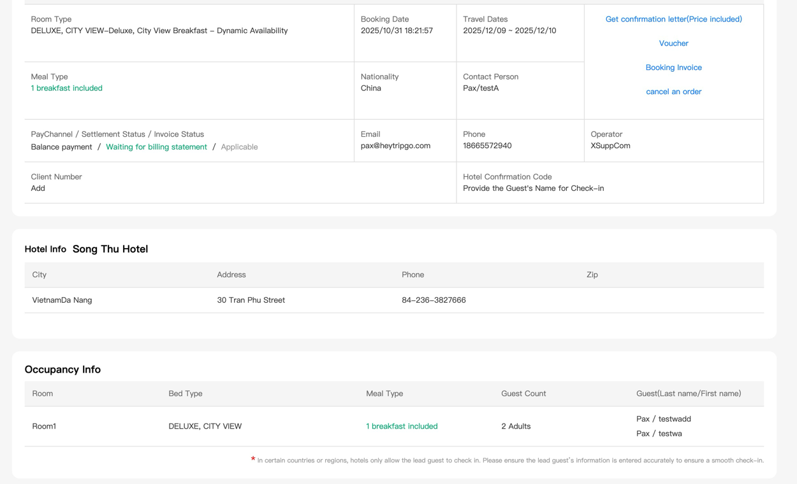
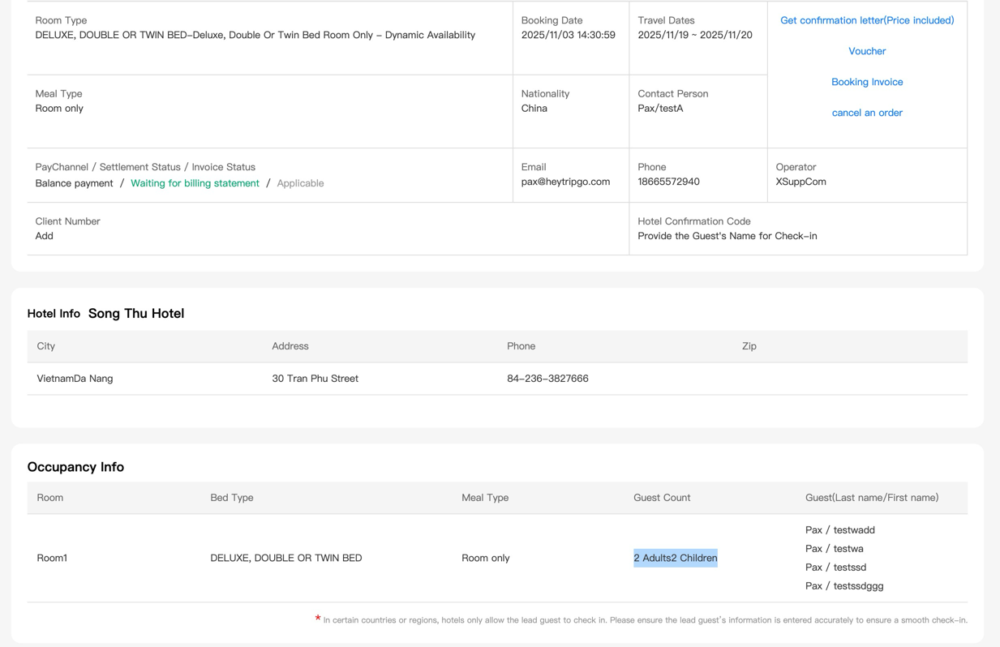
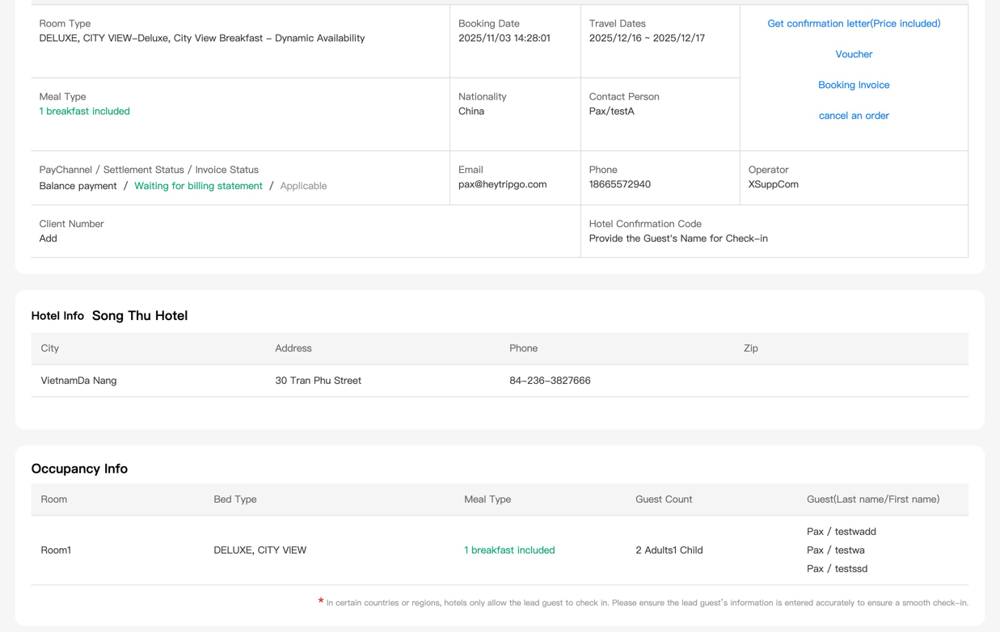
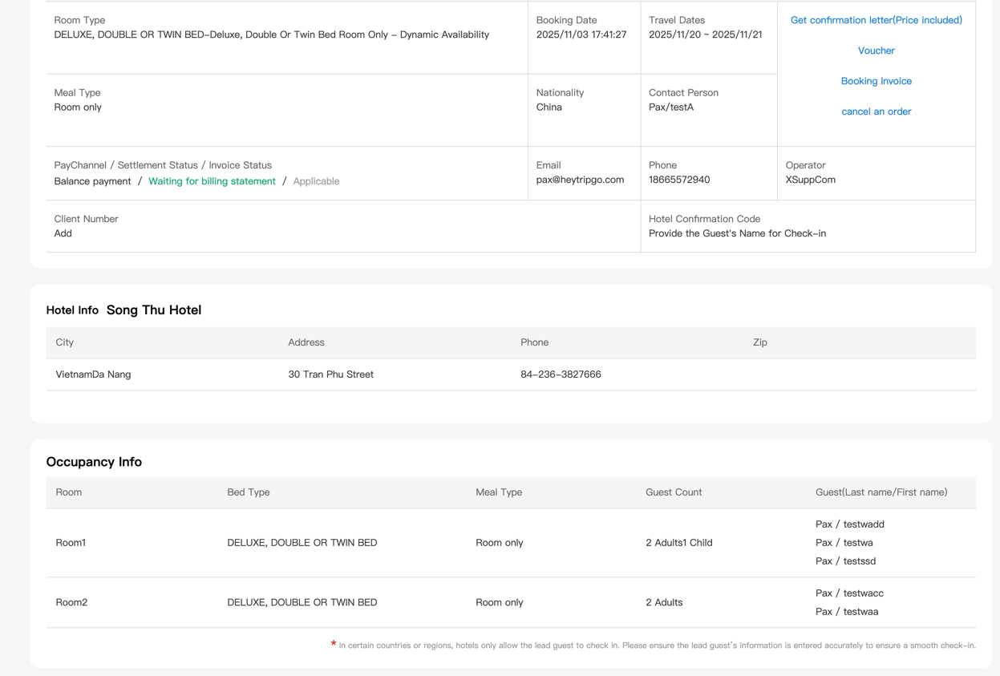

##  Acceptance Certification 


###  2 Adults × 1 Room (Total Rooms: 1)
- Hotel Country:  140  越南  Vietnam
- Hotel Name: SONG THU
- Hotel Id: OT000243877
- Order Number: 251031182146665990
- Booking Id: 21502
#### Hotel Booking Details  image


#### Reserved successful response body：
```json
{
  "bookingServiceType": "hotels",
  "bookingDetail": {
    "id": "21502",
    "agentId": "824",
    "bookingReference": "COH21502",
    "bookingDate": "2025-10-31 10:22:00",
    "totalCharges": 14.66,
    "leaderTitle": "MR",
    "leaderFirstName": "testwadd",
    "leaderLastName": "Pax",
    "currencyCode": "USD",
    "localHotelId": "OT000243877",
    "hotelName": "SONG THU",
    "countryName": "Vietnam",
    "cityId": "Da Nang",
    "hotelAddress1": "30 - 34 Tran Phu Hai Chau",
    "currentStatus": "vouchered",
    "totalAdults": "2",
    "totalChildren": "0",
    "totalRooms": "1",
    "checkInDate": "2025-12-09",
    "checkOutDate": "2025-12-10",
    "agentRefNo": "251031182146665990",
    "roomDetail": [
      {
        "roomTypeDescription": "Deluxe, City View Breakfast  - Dynamic Availability ",
        "numberOfRoom": "1",
        "passengers": [
          {
            "salutation": "MR",
            "firstName": "testwadd",
            "lastName": "Pax",
            "passengerType": "adult",
            "age": ""
          },
          {
            "salutation": "MR",
            "firstName": "testwa",
            "lastName": "Pax",
            "passengerType": "adult",
            "age": ""
          }
        ]
      }
    ]
  },
  "message": "Success",
  "startTime": "2025-10-31 10:22:00",
  "endTime": "2025-10-31 10:22:20"
}
```


### 2 Adults + 2 Children × 1    Room (Total Rooms: 1)
- Hotel Country:  140  越南  Vietnam
- Hotel Name: SONG THU
- Hotel Id: OT000243877
- Order Number: 251103143038122058
- Booking Id: 21511
#### Hotel Booking Details  image   


#### Reserved successful response body：
```json
{
  "bookingServiceType": "hotels",
  "bookingDetail": {
    "id": "21511",
    "agentId": "824",
    "bookingReference": "COH21511",
    "bookingDate": "2025-11-03 06:31:02",
    "totalCharges": 19.46,
    "leaderTitle": "MR",
    "leaderFirstName": "testwadd",
    "leaderLastName": "Pax",
    "currencyCode": "USD",
    "localHotelId": "OT000243877",
    "hotelName": "SONG THU",
    "countryName": "Vietnam",
    "cityId": "Da Nang",
    "hotelAddress1": "30 - 34 Tran Phu Hai Chau",
    "currentStatus": "vouchered",
    "totalAdults": "2",
    "totalChildren": "2",
    "totalRooms": "1",
    "checkInDate": "2025-11-19",
    "checkOutDate": "2025-11-20",
    "agentRefNo": "251103143038122058",
    "roomDetail": [
      {
        "roomTypeDescription": "Deluxe, Double Or Twin Bed Room Only  - Dynamic Availability ",
        "numberOfRoom": "1",
        "passengers": [
          {
            "salutation": "MR",
            "firstName": "testwadd",
            "lastName": "Pax",
            "passengerType": "adult",
            "age": ""
          },
          {
            "salutation": "MR",
            "firstName": "testwa",
            "lastName": "Pax",
            "passengerType": "adult",
            "age": ""
          },
          {
            "salutation": "Child",
            "firstName": "testssd",
            "lastName": "Pax",
            "passengerType": "child",
            "age": "9"
          },
          {
            "salutation": "Child",
            "firstName": "testssdggg",
            "lastName": "Pax",
            "passengerType": "child",
            "age": "3"
          }
        ]
      }
    ]
  },
  "message": "Success",
  "startTime": "2025-11-03 06:31:02",
  "endTime": "2025-11-03 06:31:23"
}
```

### 2 Adults + 1 Children × 1 Room (Total Rooms: 1)
- Hotel Country:  140  越南  Vietnam
- Hotel Name: SONG THU
- Hotel Id: OT000243877
- Order Number: 251103143859456068
- Booking Id: 21510
#### Hotel Booking Details  image


#### Reserved successful response body：
```json
{
  "bookingServiceType": "hotels",
  "bookingDetail": {
    "id": "21510",
    "agentId": "824",
    "bookingReference": "COH21510",
    "bookingDate": "2025-11-03 06:28:07",
    "totalCharges": 16.61,
    "leaderTitle": "MR",
    "leaderFirstName": "testwadd",
    "leaderLastName": "Pax",
    "currencyCode": "USD",
    "localHotelId": "OT000243877",
    "hotelName": "SONG THU",
    "countryName": "Vietnam",
    "cityId": "Da Nang",
    "hotelAddress1": "30 - 34 Tran Phu Hai Chau",
    "currentStatus": "vouchered",
    "totalAdults": "2",
    "totalChildren": "1",
    "totalRooms": "1",
    "checkInDate": "2025-12-16",
    "checkOutDate": "2025-12-17",
    "agentRefNo": "251103142747838153",
    "roomDetail": [
      {
        "roomTypeDescription": "Deluxe, City View Breakfast  - Dynamic Availability ",
        "numberOfRoom": "1",
        "passengers": [
          {
            "salutation": "MR",
            "firstName": "testwadd",
            "lastName": "Pax",
            "passengerType": "adult",
            "age": ""
          },
          {
            "salutation": "MR",
            "firstName": "testwa",
            "lastName": "Pax",
            "passengerType": "adult",
            "age": ""
          },
          {
            "salutation": "Child",
            "firstName": "testssd",
            "lastName": "Pax",
            "passengerType": "child",
            "age": "4"
          }
        ]
      }
    ]
  },
  "message": "Success",
  "startTime": "2025-11-03 06:28:07",
  "endTime": "2025-11-03 06:28:28"
}
```


### 2 Adults × 1 Room, 2 Adults + 1 Child × 1 Room (Total Rooms: 2)
- Hotel Country:  140  越南  Vietnam
- Hotel Name: SONG THU
- Hotel Id: OT000243877
- Order Number: 251103174036211276
- Booking Id: 21513

#### Hotel Booking Details  image


#### Reserved successful response body：
```json
{
  "bookingServiceType": "hotels",
  "bookingDetail": {
    "id": "21513",
    "agentId": "824",
    "bookingReference": "COH21513",
    "bookingDate": "2025-11-03 09:41:30",
    "totalCharges": 32.28,
    "leaderTitle": "MR",
    "leaderFirstName": "testwacc",
    "leaderLastName": "Pax",
    "currencyCode": "USD",
    "localHotelId": "OT000243877",
    "hotelName": "SONG THU",
    "countryName": "Vietnam",
    "cityId": "Da Nang",
    "hotelAddress1": "30 - 34 Tran Phu Hai Chau",
    "currentStatus": "vouchered",
    "totalAdults": "4",
    "totalChildren": "1",
    "totalRooms": "2",
    "checkInDate": "2025-11-20",
    "checkOutDate": "2025-11-21",
    "agentRefNo": "251103174036211276",
    "roomDetail": [
      {
        "roomTypeDescription": "Deluxe, Double Or Twin Bed Room Only  - Dynamic Availability ",
        "numberOfRoom": "1",
        "passengers": [
          {
            "salutation": "MR",
            "firstName": "testwacc",
            "lastName": "Pax",
            "passengerType": "adult",
            "age": ""
          },
          {
            "salutation": "MR",
            "firstName": "testwaa",
            "lastName": "Pax",
            "passengerType": "adult",
            "age": ""
          }
        ]
      },
      {
        "roomTypeDescription": "Deluxe, Double Or Twin Bed Room Only  - Dynamic Availability ",
        "numberOfRoom": "1",
        "passengers": [
          {
            "salutation": "MR",
            "firstName": "testwadd",
            "lastName": "Pax",
            "passengerType": "adult",
            "age": ""
          },
          {
            "salutation": "MR",
            "firstName": "testwa",
            "lastName": "Pax",
            "passengerType": "adult",
            "age": ""
          },
          {
            "salutation": "Child",
            "firstName": "testssd",
            "lastName": "Pax",
            "passengerType": "child",
            "age": "7"
          }
        ]
      }
    ]
  },
  "message": "Success",
  "startTime": "2025-11-03 09:41:30",
  "endTime": "2025-11-03 09:41:50"
}
```


### 2 Adults  × 2 Room, 1 Adult × 1 Room (Total Rooms: 3)
- Hotel Country:  138  迪拜  Dubai
- Hotel Name:  AL HAYAT HOTEL
- Hotel Id: OT000300629
- Order Number: 25110317415015325400
- Booking Id: 21526
-
#### Reserved successful response body：
```json
{
  "Message": "Success",
  "BookingServiceType": "hotels",
  "BookingDetail": {
    "TotalCharges": 176.82,
    "BookingDate": "2025-11-06 05:13:46",
    "AgentId": "824",
    "AgentRate": "176.820",
    "Id": "21526",
    "BookingReference": "COH21526",
    "VoucherId": "92645",
    "LeaderTitle": "MR",
    "LeaderFirstName": "testwaaa",
    "LeaderLastName": "Pax",
    "CurrencyCode": "USD",
    "LocalHotelId": "OT000300629",
    "HotelName": "AL HAYAT HOTEL",
    "CountryName": "United Arab Emirates",
    "CityId": "Sharjah",
    "HotelAddress1": "Zahraa Street Sharjah",
    "HotelPhone": "",
    "CurrentStatus": "vouchered",
    "ExpirationDate": "2026-01-15 15:30:00",
    "TotalChildren": "0",
    "CheckInDate": "2026-01-18",
    "CheckOutDate": "2026-01-19",
    "HotelConfirmationNumber": "",
    "SpecialRemark": "(Note: Special Requests are not guaranteed & are subject to availability upon check in at the hotel.)",
    "AgentRefNo": "25110317415015325400",
    "PassengerPhone": "",
    "PassengerEmail": "",
    "TotalAdults": "5",
    "TotalRooms": "3",
    "SelectedNights": "1",
    "RoomDetail": [
      {
        "RoomTypeDescription": "Standard Twin / Queen Room Only",
        "NumberOfRoom": "1",
        "NumberOfAdults": "2",
        "NumberOfChild": "0",
        "Passengers": [
          {
            "Salutation": "MR",
            "FirstName": "testwaaa",
            "LastName": "Pax",
            "PassengerType": "adult",
            "Age": ""
          },
          {
            "Salutation": "MR",
            "FirstName": "testwabb",
            "LastName": "Pax",
            "PassengerType": "adult",
            "Age": ""
          }
        ]
      },
      {
        "RoomTypeDescription": "Standard Twin / Queen Room Only",
        "NumberOfRoom": "1",
        "NumberOfAdults": "2",
        "NumberOfChild": "0",
        "Passengers": [
          {
            "Salutation": "MR",
            "FirstName": "testwacc",
            "LastName": "Pax",
            "PassengerType": "adult",
            "Age": ""
          },
          {
            "Salutation": "MR",
            "FirstName": "testddd",
            "LastName": "Pax",
            "PassengerType": "adult",
            "Age": ""
          }
        ]
      },
      {
        "RoomTypeDescription": "Standard Twin / Queen Room Only",
        "NumberOfRoom": "1",
        "NumberOfAdults": "1",
        "NumberOfChild": "0",
        "Passengers": [
          {
            "Salutation": "MR",
            "FirstName": "testwaee",
            "LastName": "Pax",
            "PassengerType": "adult",
            "Age": ""
          }
        ]
      }
    ],
    "VoucherLink": "http://colosseum.otrams.com/print_voucher.php?is_mobile=1&code=ba4465b74a54ffa18ecfeb3518315fad1558321526",
    "InvoiceLink": "http://colosseum.otrams.com/print_invoice.php?is_mobile=1&id=21526&type=hotel&print_invoice=1",
    "CustomerInvoiceLink": "http://colosseum.otrams.com/print_invoice.php?is_mobile=1&id=21526&type=hotel&customer_invoice=1"
  },
  "StartTime": "2025-11-06 05:14:21",
  "EndTime": "2025-11-06 05:14:21"
}
```


### 2 Adults + 2 Child × 1 Room, 2 Adults × 1 Room, 1 Adult × 1 Room (Total Rooms: 3)  
- Hotel Country:  138  迪拜  Dubai
- Hotel Name:  AL HAYAT HOTEL
- Hotel Id: OT000300629
- Order Number: 25110317415015325499
- Booking Id: 21525
- 
#### Reserved successful response body：
```json
{
  "Message": "Success",
  "BookingServiceType": "hotels",
  "BookingDetail": {
    "TotalCharges": 176.82,
    "BookingDate": "2025-11-06 05:01:11",
    "AgentId": "824",
    "AgentRate": "176.820",
    "Id": "21525",
    "BookingReference": "COH21525",
    "VoucherId": "93341",
    "LeaderTitle": "MR",
    "LeaderFirstName": "testwaaa",
    "LeaderLastName": "Pax",
    "CurrencyCode": "USD",
    "LocalHotelId": "OT000300629",
    "HotelName": "AL HAYAT HOTEL",
    "CountryName": "United Arab Emirates",
    "CityId": "Sharjah",
    "HotelAddress1": "Zahraa Street Sharjah",
    "HotelPhone": "",
    "CurrentStatus": "vouchered",
    "ExpirationDate": "2026-01-19 15:30:00",
    "TotalChildren": "2",
    "CheckInDate": "2026-01-22",
    "CheckOutDate": "2026-01-23",
    "HotelConfirmationNumber": "",
    "SpecialRemark": "(Note: Special Requests are not guaranteed & are subject to availability upon check in at the hotel.)",
    "AgentRefNo": "25110317415015325499",
    "PassengerPhone": "",
    "PassengerEmail": "",
    "TotalAdults": "5",
    "TotalRooms": "3",
    "SelectedNights": "1",
    "RoomDetail": [
      {
        "RoomTypeDescription": "Standard Twin / Queen Room Only",
        "NumberOfRoom": "1",
        "NumberOfAdults": "2",
        "NumberOfChild": "2",
        "Passengers": [
          {
            "Salutation": "MR",
            "FirstName": "testwaaa",
            "LastName": "Pax",
            "PassengerType": "adult",
            "Age": ""
          },
          {
            "Salutation": "MR",
            "FirstName": "testwabb",
            "LastName": "Pax",
            "PassengerType": "adult",
            "Age": ""
          },
          {
            "Salutation": "Child",
            "FirstName": "testwababy1",
            "LastName": "Pax",
            "PassengerType": "child",
            "Age": "3"
          },
          {
            "Salutation": "Child",
            "FirstName": "testwababy2",
            "LastName": "Pax",
            "PassengerType": "child",
            "Age": "5"
          }
        ]
      },
      {
        "RoomTypeDescription": "Standard Twin / Queen Room Only",
        "NumberOfRoom": "1",
        "NumberOfAdults": "2",
        "NumberOfChild": "0",
        "Passengers": [
          {
            "Salutation": "MR",
            "FirstName": "testwacc",
            "LastName": "Pax",
            "PassengerType": "adult",
            "Age": ""
          },
          {
            "Salutation": "MR",
            "FirstName": "testddd",
            "LastName": "Pax",
            "PassengerType": "adult",
            "Age": ""
          }
        ]
      },
      {
        "RoomTypeDescription": "Standard Twin / Queen Room Only",
        "NumberOfRoom": "1",
        "NumberOfAdults": "1",
        "NumberOfChild": "0",
        "Passengers": [
          {
            "Salutation": "MR",
            "FirstName": "testwaee",
            "LastName": "Pax",
            "PassengerType": "adult",
            "Age": ""
          }
        ]
      }
    ],
    "VoucherLink": "http://colosseum.otrams.com/print_voucher.php?is_mobile=1&code=6f955ccbbaea1502e5f26e6bf89bdcaa3074921525",
    "InvoiceLink": "http://colosseum.otrams.com/print_invoice.php?is_mobile=1&id=21525&type=hotel&print_invoice=1",
    "CustomerInvoiceLink": "http://colosseum.otrams.com/print_invoice.php?is_mobile=1&id=21525&type=hotel&customer_invoice=1"
  },
  "StartTime": "2025-11-06 05:01:58",
  "EndTime": "2025-11-06 05:01:58"
}
```

